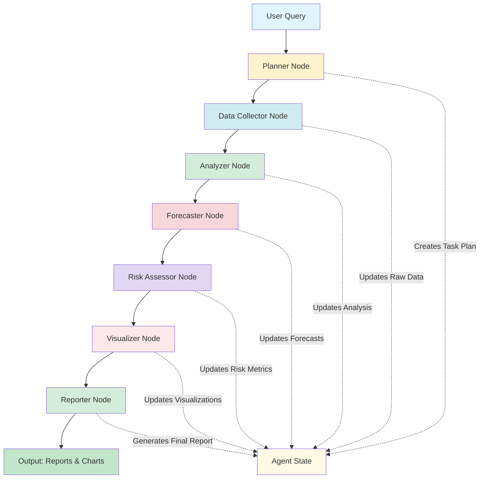

# Deep Agent for Commodity Price Analysis

A comprehensive **LangGraph-based Deep Agent** system for analyzing commodity prices using FRED economic data, featuring advanced statistical analysis, multi-method forecasting, and comprehensive risk assessment. Built with **LangChain** and **OpenAI GPT-4**, this autonomous agent orchestrates complex analysis workflows through a directed graph architecture.


## 📊 Project Overview

This Deep Agent system autonomously performs end-to-end commodity analysis by:
- **Planning**: Creates comprehensive analysis strategies
- **Data Collection**: Fetches real-time data from FRED and Yahoo Finance
- **Analysis**: Performs statistical, trend, and pattern analysis
- **Forecasting**: Generates multi-method price predictions
- **Risk Assessment**: Calculates VaR, CVaR, Sharpe Ratio, and drawdown metrics
- **Visualization**: Creates professional charts and graphs
- **Reporting**: Generates comprehensive text and JSON reports

### What is a Deep Agent?

A **Deep Agent** is an AI system that uses LangGraph to create a stateful, multi-step workflow where each node performs specialized tasks. Unlike simple chatbots, Deep Agents:
- Maintain complex state across multiple operations
- Make autonomous decisions about analysis paths
- Coordinate multiple specialized tools and models
- Execute long-running, multi-stage workflows
- Self-monitor and adapt based on intermediate results

## 🎯 Key Features

### 🤖 Autonomous Agent Architecture
- **LangGraph State Machine**: Directed graph workflow with 7 specialized nodes
- **OpenAI GPT-4 Integration**: LLM-powered planning and decision-making
- **Stateful Execution**: Tracks progress, insights, and errors throughout the workflow
- **Task Orchestration**: Automatic coordination of data collection, analysis, and reporting

### 📈 Commodity Coverage

**Metals:**
- Gold (Producer Price Index)
- Aluminium (LME spot price)
- Platinum (Producer Price Index)

**Energy:**
- Natural Gas (Henry Hub spot price)
- Gasoline (US regular retail price)
- Crude Oil (WTI spot price)

### 🔬 Advanced Analytics

**Statistical Analysis:**
- Descriptive statistics (mean, median, std dev, skewness, kurtosis)
- Distribution analysis and coefficient of variation
- Rolling statistics and momentum indicators

**Trend Detection:**
- Moving average crossovers (30-day, 90-day)
- Linear regression trend lines with R² strength
- Support and resistance level identification

**Pattern Recognition:**
- Seasonal decomposition (multiplicative model)
- Cycle detection and volatility clustering
- Price level analysis with z-scores

**Correlation Analysis:**
- Inter-commodity correlation matrices
- Rolling correlation tracking
- Portfolio diversification metrics

### 🔮 Multi-Method Forecasting

**Ensemble Forecasting** (Primary):
- **Prophet**: Facebook's time series forecasting (60% weight)
- **Linear Regression**: Trend-based projection (20% weight)
- **Moving Average**: Momentum-based forecast (20% weight)

**Forecast Horizon**: 1,917 days (until December 31, 2030)

### ⚠️ Risk Assessment

**Value at Risk (VaR):**
- Historical VaR at 95% confidence
- Parametric VaR (normal distribution)
- Dollar-value risk quantification

**Additional Metrics:**
- Conditional VaR (Expected Shortfall)
- Sharpe Ratio for risk-adjusted returns
- Maximum Drawdown analysis
- Portfolio-level risk aggregation

### 📊 Visualizations

Six comprehensive charts:
1. **Price History**: Historical trends with regression lines
2. **Returns Distribution**: Histogram analysis of daily returns
3. **Correlation Matrix**: Heatmap of inter-commodity correlations
4. **Rolling Volatility**: 30-day annualized volatility tracking
5. **Forecast Charts**: Historical data with future projections and confidence intervals
6. **Risk Metrics Comparison**: Bar charts comparing VaR, Sharpe Ratio, and Drawdown

## 🏗️ System Architecture



### Workflow Description

1. **Planner Node**: Analyzes user query and creates comprehensive task plan
2. **Data Collector Node**: Fetches commodity data from FRED API with SSL verification
3. **Analyzer Node**: Performs statistical, trend, pattern, and correlation analysis
4. **Forecaster Node**: Generates ensemble forecasts using Prophet, Linear, and MA methods
5. **Risk Assessor Node**: Calculates VaR, CVaR, Sharpe Ratio, and portfolio risk
6. **Visualizer Node**: Creates 6 professional charts and saves as PNG files
7. **Reporter Node**: Generates comprehensive text report and JSON data export

## 📦 Installation

### Prerequisites
- Python 3.11 or higher
- pip package manager
- Virtual environment (recommended)

### Step 1: Clone Repository

```bash
git clone https://github.com/NatalieCheong/Deep_Agent_Commodities_Price_Analysis_LangGraph/
cd DeepAgent_Commodities_Price_Analysis
```

### Step 2: Create Virtual Environment

```bash
python3 -m venv venv
source venv/bin/activate  # On Windows: venv\Scripts\activate
```

### Step 3: Install Dependencies

```bash
pip install -r requirements.txt
```

### Step 4: Configure API Keys

1. Copy the example environment file:
```bash
cp .env.example .env
```

2. Edit `.env` and add your API keys:

```bash
# FRED API Key (Required - FREE)
FRED_API_KEY=your_fred_api_key_here

# OpenAI API Key (Required)
OPENAI_API_KEY=your_openai_api_key_here
```

**Get API Keys:**
- **FRED API**: [https://fred.stlouisfed.org/docs/api/api_key.html](https://fred.stlouisfed.org/docs/api/api_key.html) (FREE)
- **OpenAI API**: [https://platform.openai.com/api-keys](https://platform.openai.com/api-keys)

## 🚀 Usage

### Quick Start

```bash
python main.py
```

You'll see an interactive menu:

```
================================================================================
COMMODITY ANALYSIS OPTIONS
================================================================================

1. Full Analysis (All 6 commodities)
2. Metals Analysis (Gold, Aluminium, Platinum)
3. Energy Analysis (Natural Gas, Gasoline, Crude Oil)
4. Custom Selection
5. Quick Test (Gold and Crude Oil only)

Enter choice (1-5) or press Enter for Full Analysis:
```

### Example Output

```
================================================================================
ANALYSIS COMPLETE
================================================================================
✓ Completed 7 tasks
✓ Generated 11 insights
✓ Created 6 visualizations

Key Insights:
  1. Natural_Gas: downward trend with strength 0.00
  2. Gasoline: downward trend with strength 0.21
  3. Crude_Oil: downward trend with strength 0.18
  4. Natural_Gas forecast: +237.87% expected change
  5. Crude_Oil forecast: -122.88% expected change
  6. Gold VaR: 1.72% daily risk at 95% confidence
  7. Aluminium VaR: 9.36% daily risk at 95% confidence
  8. Platinum VaR: 2.44% daily risk at 95% confidence
  9. Natural_Gas VaR: 9.76% daily risk at 95% confidence
  10. Gasoline VaR: 2.95% daily risk at 95% confidence

Reports and visualizations saved to: results
```

### Output Structure

```
results/
├── reports/
│   ├── commodity_analysis_report_YYYYMMDD_HHMMSS.txt
│   └── analysis_results_YYYYMMDD_HHMMSS.json
├── charts/
│   ├── price_history.png
│   ├── returns_distribution.png
│   ├── correlation_matrix.png
│   ├── rolling_volatility.png
│   ├── all_forecasts.png
│   └── risk_metrics_comparison.png
└── data/
    └── (cached data files)
```

## 📊 Sample Results

### Statistical Summary

| Commodity   | Mean Price | Volatility (CV) | Skewness | Kurtosis |
|-------------|------------|-----------------|----------|----------|
| Gold        | $240.37    | 9.33%          | -0.716   | -1.137   |
| Aluminium   | $2332.62   | 17.44%         | 0.116    | 0.550    |
| Platinum    | $256.41    | 10.02%         | -0.782   | -1.008   |
| Natural Gas | $3.40      | 53.34%         | 1.557    | 1.942    |
| Gasoline    | $3.18      | 19.67%         | -0.049   | 0.306    |
| Crude Oil   | $70.83     | 26.92%         | -0.381   | 0.663    |

### Risk Metrics

| Commodity   | VaR (95%) | Sharpe Ratio | Max Drawdown | Interpretation        |
|-------------|-----------|--------------|--------------|----------------------|
| Gold        | 1.72%     | 4.923        | -5.17%       | Excellent returns    |
| Aluminium   | 9.36%     | 2.019        | -38.96%      | Excellent returns    |
| Platinum    | 2.44%     | 3.876        | -7.91%       | Excellent returns    |
| Natural Gas | 9.76%     | 0.634        | -89.31%      | Acceptable returns   |
| Gasoline    | 2.95%     | 0.624        | -39.95%      | Acceptable returns   |
| Crude Oil   | 4.13%     | 0.280        | -85.92%      | Acceptable returns   |

**Portfolio Risk:**
- Annual Return: 43.06%
- Annual Volatility: 34.64%
- Portfolio Sharpe Ratio: 1.243
- Diversification Benefit: High

### Price Forecasts (to Dec 2030)

| Commodity   | Current Price | Final Forecast | Expected Change |
|-------------|---------------|----------------|-----------------|
| Natural Gas | $2.90         | $9.80          | +237.87%        |
| Crude Oil   | $62.99        | $-14.41*       | -122.88%*       |

*Note: Negative forecast indicates model uncertainty for long-term projection

## 🛠️ Technical Stack

### Core Framework
- **LangChain 0.1.0**: Orchestration framework
- **LangGraph 0.0.20**: State machine and workflow management
- **LangChain-OpenAI 0.0.5**: LLM integration

### Data & APIs
- **fredapi 0.5.1**: Federal Reserve Economic Data
- **yfinance 0.2.36**: Yahoo Finance fallback
- **python-dotenv 1.0.0**: Environment configuration

### Analysis & ML
- **pandas 2.1.4**: Data manipulation
- **numpy 1.26.2**: Numerical computing
- **scikit-learn 1.3.2**: Machine learning
- **statsmodels 0.14.1**: Statistical models
- **prophet 1.1.5**: Time series forecasting
- **scipy 1.11.4**: Scientific computing

### Visualization
- **matplotlib 3.8.2**: Plotting
- **seaborn 0.13.0**: Statistical visualization
- **plotly 5.18.0**: Interactive charts

## 📁 File Structure

```
DeepAgent_Commodities_Price_Analysis/
├── requirements.txt           # Python dependencies
├── .env.example              # Example environment variables
├── .env                      # Your API keys (create this)
├── README.md                 # This file
├── config.py                 # Configuration and commodity tickers
├── state.py                  # LangGraph state management
├── data_collector.py         # FRED/Yahoo Finance data fetching
├── analysis_tools.py         # Statistical and trend analysis
├── forecasting.py            # Prophet and ensemble forecasting
├── risk_analysis.py          # VaR, CVaR, Sharpe ratio
├── visualization.py          # Chart generation
├── report_generator.py       # Report creation
├── agent.py                  # Main LangGraph agent
├── main.py                   # Entry point
└── results/                  # Output directory
    ├── reports/              # Text and JSON reports
    ├── charts/               # PNG visualizations
    └── data/                 # Cached data
```

## 🎓 Educational Value

This project demonstrates:

1. **Deep Agent Architecture**: Building autonomous AI agents with LangGraph
2. **State Management**: Maintaining complex state across multi-step workflows
3. **Time Series Analysis**: Statistical methods for commodity price analysis
4. **Forecasting Techniques**: Ensemble methods combining multiple models
5. **Risk Management**: Financial risk metrics and portfolio analysis
6. **Data Visualization**: Creating professional analytical charts
7. **API Integration**: Working with FRED and OpenAI APIs
8. **Production Patterns**: Error handling, logging, and report generation

## 🤝 Acknowledgements

### Data Sources
- **Federal Reserve Economic Data (FRED)**: Provided by the Federal Reserve Bank of St. Louis
- **Yahoo Finance**: Fallback data source for certain commodities

### Frameworks & Libraries
- **LangChain**: For LLM orchestration and agent framework
- **LangGraph**: For stateful workflow management
- **Facebook Prophet**: For robust time series forecasting
- **OpenAI**: For GPT-4 language model capabilities

### Inspiration
This project was inspired by the **LangChain Deep Agents from Scratch** tutorial and adapted for financial commodity analysis with enhanced forecasting and risk assessment capabilities.

### Special Thanks
- The **LangChain community** for excellent documentation and examples
- **FRED** for providing free, high-quality economic data
- The open-source community for the excellent Python data science ecosystem

## 📝 License

This project is licensed under the MIT License - see the LICENSE file for details.

## 🔮 Future Enhancements

- [ ] Real-time streaming data updates
- [ ] Additional commodities (coffee, wheat, copper)
- [ ] Machine learning price prediction models
- [ ] Interactive web dashboard
- [ ] Portfolio optimization algorithms
- [ ] Alert system for significant price movements
- [ ] Integration with trading platforms
- [ ] Sentiment analysis from news sources
- [ ] Multi-currency support

---

**Built with ❤️ using LangChain, LangGraph, and OpenAI GPT-4**

*Disclaimer: This tool is for educational and research purposes only. Not financial advice.*
